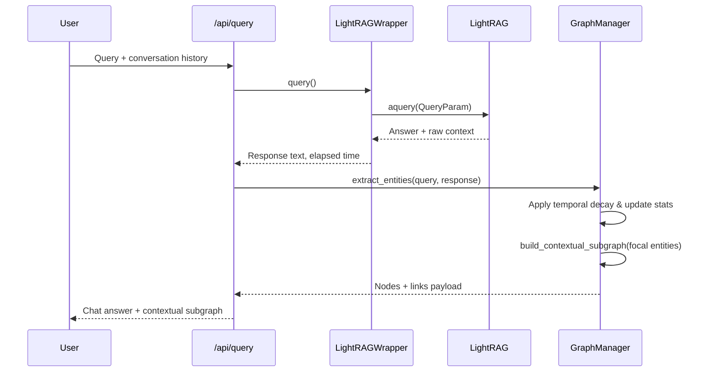
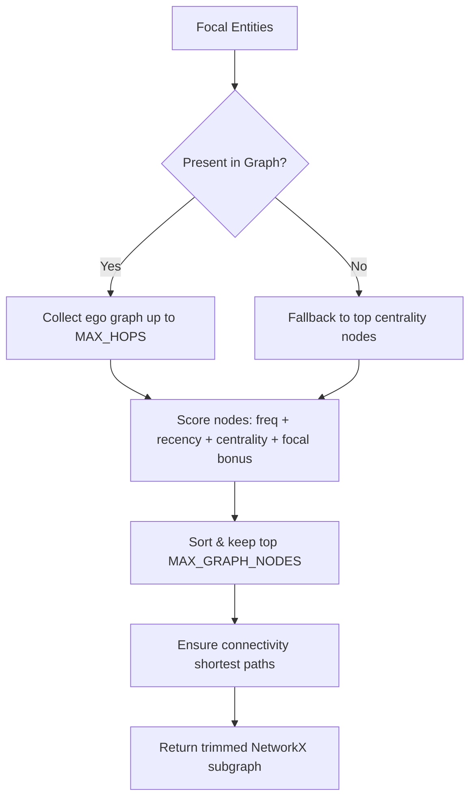

# Backend Guide

This document explains how the FastAPI + LightRAG backend is structured, how configuration works, and how to operate or extend the server.

## Directory Layout

```
backend/
├── data/
│   └── corpus/           # Drop-source for documents before ingestion
├── lightrag_storage/     # LightRAG runtime data (GraphML, vector DBs, caches)
├── src/
│   ├── api/
│   │   ├── routes.py     # REST endpoints
│   │   └── websocket.py  # WebSocket handler
│   ├── core/
│   │   ├── config.py     # Pydantic Settings
│   │   ├── graph_manager.py
│   │   └── lightrag_wrapper.py
│   ├── models/
│   │   └── schemas.py    # Pydantic request/response models
│   └── utils/
│       └── helpers.py    # File parsing helpers
└── .env                  # Runtime configuration (not committed)
```

## Configuration (`core/config.py`)

Settings are provided via environment variables and loaded through Pydantic. Important fields:

- `API_HOST`, `API_PORT`: where Uvicorn binds the API (default `0.0.0.0:8002`).
- `CORS_ORIGINS`: defaults to the Vite dev ports (5173, 5174, 5175). Extend when deploying elsewhere.
- `LIGHTRAG_WORKING_DIR`: directory containing LightRAG artefacts (`graph_chunk_entity_relation.graphml`, vector stores, caches).
- `OPENAI_API_KEY`, `OPENAI_EMBEDDING_MODEL`, `OPENAI_EMBEDDING_DIM`: used for LightRAG’s LLM and embedding calls.
- Graph knobs: `MAX_GRAPH_NODES`, `MAX_HOPS`, decay/weight factors controlling contextual subgraph building.

### Tip

Keep `.env` out of version control. Copy `backend/.env.example` as a starting point.

## LightRAG Wrapper (`core/lightrag_wrapper.py`)

`LightRAGWrapper` abstracts away the boilerplate needed to interact with LightRAG safely:

- Ensures both `initialize_storages()` and `initialize_pipeline_status()` are called on startup.
- Supplies LightRAG with OpenAI-compatible embedding + completion functions (using the models defined in settings).
- Exposes `query()` that accepts conversation history, mode, and optional user prompt; it returns the combined response string and elapsed time.
- Manages ingestion through `start_ingestion()` and `ingest_corpus()`, with progress surfaced via `IngestStatus` and automatic entity cache refreshes.
- Handles GraphML path detection. LightRAG currently writes `graph_chunk_entity_relation.graphml`; the wrapper resolves that file and falls back gracefully if the namespace changes.
- Provides simple helpers (`get_ingest_status()`, `refresh_entity_cache()`, `wait_for_ingestion()`) for other layers to call.

### Error Handling

All LightRAG errors are logged. Unexpected exceptions get wrapped into `RuntimeError("LightRAG query failed")`, allowing API routes to surface clean HTTP 500 responses without leaking stack traces to the client.

## Graph Manager (`core/graph_manager.py`)
### Subgraph & Query Pipeline



The end-to-end flow ties LightRAG and the graph manager together so every answer is paired with a visual explanation.

### Entity Harvesting

1. **LightRAG metadata** — Document ingestion stores entities and relations. After ingestion completes the wrapper calls `get_graph_labels()` to refresh an in-memory cache of known labels.
2. **Query-time extraction** — Once a response arrives, `GraphManager.extract_entities()` scans the query and response text for those labels (case-insensitive). You can plug in fuzzy or NER logic here.
3. **Frequency & recency** — Each mentioned entity increments a counter and `entity_last_seen` timestamp. `apply_temporal_decay()` gradually lowers scores for stale topics using the configured decay rate.

### Subgraph Construction (`build_contextual_subgraph`)



- **Ego expansion** keeps neighbourhoods tight and computationally cheap.
- **Importance scoring** combines normalised frequency, exponential recency decay, cached PageRank and a focal-entity bonus.
- **Connectivity guard** brings in the shortest path between disconnected focal clusters so the graph doesn’t fracture visually.

### Visual Payload

`graph_to_vis_format()` converts the NetworkX subgraph into the JSON structure consumed by the frontend:

- Node `size` is derived from the importance score (8px base + scaled weight).
- `color` and `type` come from graph metadata (`entity_type`, `label`, etc.).
- Flags such as `is_focal`, `frequency`, and `centrality` let the UI highlight context.
- Edges carry `relationship`, `keywords`, and `weight` fields that D3 uses for styling.

### When LightRAG Returns Empty Context

If LightRAG can’t find relevant chunks (zero entities/relations):

- The wrapper logs the situation and returns an empty string.
- The graph manager falls back to the most central nodes so the canvas isn’t blank.
- You can customise this behaviour (e.g., surface a “no evidence found” message or prompt for ingestion).


Responsibilities:

1. Load the GraphML file from LightRAG’s storage and pre-compute lookup indices.
2. Track per-entity frequency, recency (`entity_last_seen` with exponential decay), and cached centrality (PageRank with a fallback to degree centrality).
3. Build contextual subgraphs by:
   - Finding focal entities extracted from the query/response text.
   - Expanding n-hop neighborhoods.
   - Scoring candidate nodes using frequency, recency, centrality, and focal-entity bonuses.
   - Limiting to `MAX_GRAPH_NODES` while maintaining connectivity.
4. Translate NetworkX structures to the frontend format (`nodes/links` JSON with sizes, colours, and metadata).
5. Provide aggregate stats (total queries, most-discussed entities, average response time, current graph size).

## API Endpoints (`api/routes.py`)

| Method | Path | Description |
| ------ | ---- | ----------- |
| POST | `/api/query` | Chat endpoint. Accepts `QueryRequest`, returns `QueryResponse` with optional graph snapshot. |
| GET | `/api/graph/full` | Dump the entire graph in visualisation format (use sparingly). |
| GET | `/api/graph/subgraph?entities=A,B` | Fetch a subgraph around named entities. |
| GET | `/api/stats` | Current conversation statistics. |
| POST | `/api/documents/upload` | Multipart file upload (stored in `data/corpus`). |
| POST | `/api/documents/ingest` | Kick off ingestion (async). |
| GET | `/api/documents/ingest/status` | Poll ingestion status. |
| GET | `/api/health` | Simple health indicator + LightRAG readiness.

All routes share dependencies via FastAPI’s `Depends` system; the app `state` holds the initialised `Settings`, `LightRAGWrapper`, and `GraphManager` instances.

### Background Ingestion

`POST /api/documents/ingest` launches a background task that:

1. Iterates over files returned by `iter_corpus_files()`.
2. Reads and normalises content (`utils/helpers.py` handles txt/md/json/pdf/docx with sensible fallbacks; encrypted PDFs raise a clear error).
3. Calls `LightRAGWrapper.insert_documents()` to batch insert text.
4. Aggregates errors without aborting the entire batch. Successful ingestions increment the processed counter.
5. On completion, refreshes the GraphML path and reloads the `GraphManager` state.

## WebSocket (`api/websocket.py`)

- Accepts `{type:"query"}` messages with query text and conversation history.
- Passes requests through `LightRAGWrapper.query`.
- Builds an updated subgraph and sends `{type:"response"}` messages containing the answer, graph, entities, and processing time.
- Handles invalid payloads and LightRAG errors gracefully.

## Useful Commands

```bash
# Format / lint (Python)
uv run python -m compileall src

# Manual health check
curl http://localhost:8002/api/health

# Quick query test
curl -X POST http://localhost:8002/api/query \
  -H "Content-Type: application/json" \
  -d '{"query": "Describe the corpus", "mode": "hybrid"}'
```

## Troubleshooting

- **`LightRAG query failed`**: Usually means LightRAG returned no context (0 entities/relations). Inspect backend logs for the preceding WARN/ERROR lines and consider enriching the corpus or adjusting LightRAG modes.
- **Graph reload warnings**: After ingestion the warning disappears once `graph_chunk_entity_relation.graphml` is present. Ensure you call `/api/documents/ingest/status` until completion.
- **CORS issues**: Update `CORS_ORIGINS` to include your frontend origin(s) if running on custom hosts or ports.

For deeper changes, examine `lightrag_wrapper.py` and `graph_manager.py` side-by-side; they provide the integration points most teams customise.
