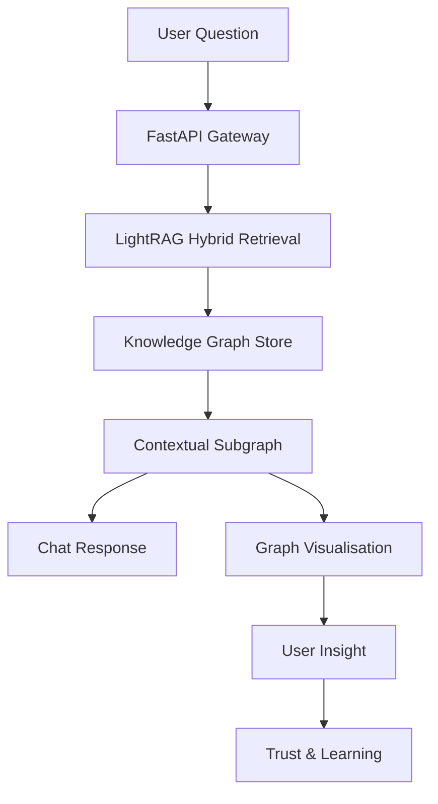
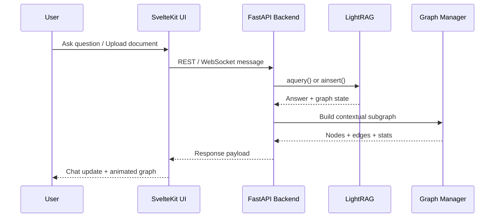
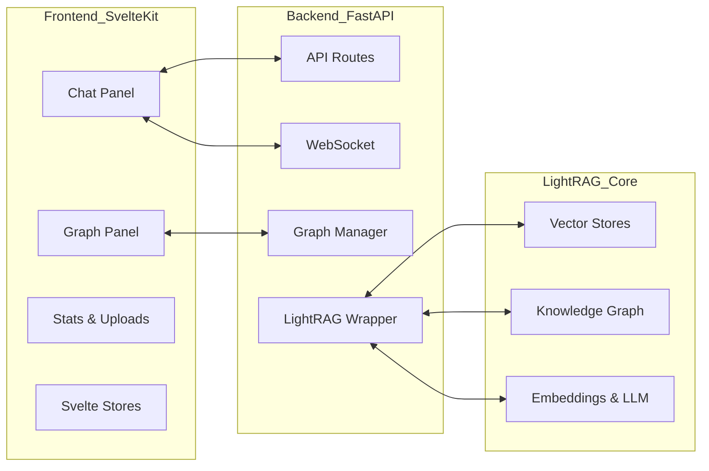
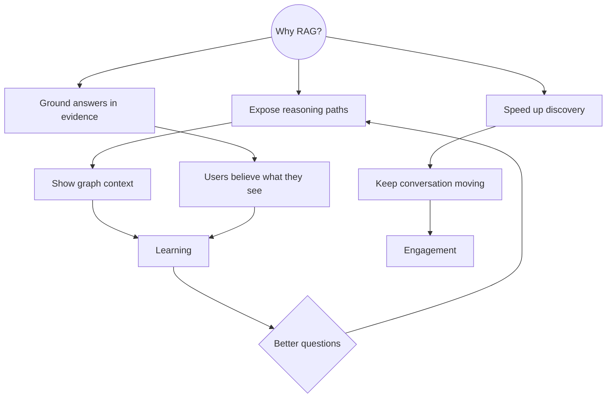

# Concept & Narrative Guide

Understanding **why** this project exists and what experience it creates will make the technical pieces in the other docs feel purposeful. This document sets the scene.

## Big Idea

Traditional Retrieval-Augmented Generation (RAG) systems feel like black boxes: you ask a question, an answer appears, and you have no insight into how the underlying knowledge base influenced it. This project makes that reasoning process **visible** by:

1. Building a knowledge graph from ingested documents (via LightRAG).
2. Letting users chat with the corpus, using hybrid retrieval to combine vector search and graph reasoning.
3. Surfacing the subgraph “thought process” behind each answer, live, so users see **which entities and relationships mattered**.

That visibility builds trust, helps with debugging content gaps, and turns the system into a learning tool—users can literally watch the graph evolve as topics change.

## See the Forest (What & Why)

The original intention of this project was simple: **let people chat with their documents and simultaneously watch the reasoning graph breathe in front of them**. To honour that, we paint the whole forest before zooming into individual trees.

*Forest view:* a question flows through the gateway, LightRAG consults the forest of knowledge, and the answer returns with a highlighted cluster so the user sees **both the tree and the forest**.

## Walk Between the Trees (How it Moves)

Each stop in the sequence is one step closer to the canopy or the roots. The UI keeps the conversation flowing; the backend composes LightRAG’s answer with graph context so the user never loses sight of neighbouring branches.

## Where Everything Lives (Structure)

The **where**: frontend and backend dance together, while LightRAG tends the forest floor (graph, vectors, embeddings). The Graph Manager is the ranger who decides which clearing to spotlight.

## Why It Matters (Value Flow)

Seeing the reasoning makes people ask better questions, which in turn illuminates more of the forest. That virtuous loop is the heart of the experience.

## What the UI Shows

- **Chat Panel**: a standard conversational interface with a mode switch (naive/local/global/hybrid/mix), entity badges beneath each message, and live status while LightRAG works.
- **Graph Panel**: a D3 force-directed graph where node size, colour, and halo reflect importance to the current conversation. Nodes and links transition smoothly when context changes.
- **Graph Stats**: totals, unique entities, most-discussed concepts, response times—giving a sense of the conversation’s footprint.
- **Document Upload**: drag-and-drop, ingestion triggers, and progress. It’s intentionally accessible so non-engineers can add knowledge without touching the backend.
- **View Toggle**: quickly focus on graph-only, chat-only, or split view depending on the task.

The combination gives both chat efficiency **and** graph literacy: you can ask “What happened with Project Naoko?”, read the answer, then glance over and see Naoko linked to relevant teams, dates, or events.

## How It’s Built (Moving Parts)

| Layer | Responsibilities | Key Files |
| ----- | ---------------- | --------- |
| **LightRAG** | Ingest documents, build graph + embeddings, answer questions with hybrid retrieval modes. | Managed via `backend/src/core/lightrag_wrapper.py` |
| **FastAPI Backend** | Provide REST/WebSocket APIs, track conversation state, translate graph to frontend-friendly formats. | `backend/src/api/routes.py`, `backend/src/api/websocket.py`, `backend/src/core/graph_manager.py` |
| **SvelteKit Frontend** | Render chat, graph, stats, and uploads; handle real-time updates. | Components & stores in `frontend/src/lib` |

### Data Flow (High-Level)

1. **Document ingestion** writes to LightRAG’s working dir (`graph_chunk_entity_relation.graphml`, vector JSONs, caches).
2. **Query** arrives via REST or WebSocket → `LightRAGWrapper.query()` orchestrates LightRAG, includes recent conversation history for context.
3. **Subgraph creation** uses `GraphManager.build_contextual_subgraph()` to score and extract relevant nodes/edges with temporal decay.
4. **Frontend update** merges the new answer into chat state and animates the graph to highlight the current focus.

### Technology Choices

- **LightRAG HKU build** for knowledge graph + RAG synergy and async ingestion.
- **FastAPI** for modern async APIs and dependency injection.
- **NetworkX** for graph algorithms (PageRank, ego graphs).
- **SvelteKit + D3** for reactive UI and smooth graph animations.
- **Tailwind** for rapid styling (with room to swap themes/brand quickly).
- **uv** and **npm** for deterministic environments.

## Experience Goals

- **Transparency**: Users should feel confident that answers are rooted in the ingested documents. The graph is the proof.
- **Exploration**: The graph’s interactivity invites a “discover as you read” mindset; it’s as much a *learning environment* as it is a Q&A interface.
- **Extensibility**: Each layer is modular. Swap in better entity extraction, run custom scoring, or plug in a different LLM—all without dumping the entire architecture.

## Storyboarding a Conversation

1. **Upload**: Alice drags “Project Naoko Summary.pdf” into the UI and clicks “Start Ingestion.” The backend reads, extracts, and builds the graph.
2. **First Query**: Alice asks, “What is Project Naoko?” The answer summarises from LightRAG, and the graph lights up with Naoko, key stakeholders, and timelines.
3. **Follow-up**: Alice asks, “Who leads the effort?” The subgraph shifts focus to the responsible team; frequency/recency values update, so the same nodes glow brighter.
4. **Learning Insight**: Alice discovers a previously unnoticed dependency because the graph shows cross-links to another initiative; she exports the knowledge or updates the corpus.

## Who Is This For?

- **Knowledge teams** wanting to surface graph context alongside LLM answers.
- **Engineers** experimenting with LightRAG or seeking a production-ready reference implementation.
- **Educators** demonstrating RAG concepts with tangible visual feedback.

## How To Extend the Story

- **Integrate a Q&A history export** so analysts can share graph-backed answers.
- **Add filters** (entity type, timeframe) for focused graph views.
- **Introduce multi-user collaboration**: share the same graph view across sessions.
- **Layer in analytics** (e.g., topic clustering, community detection) for deeper insights.

By internalising this narrative, you’ll find it easier to tailor the system to your own domain—be it legal documents, product manuals, or research portfolios.
