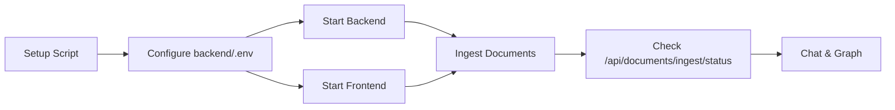

# Operations & Troubleshooting

This guide collects common operational tasks, production considerations, and fixes for known issues.

## Quick Reference

| Task | Command / Action |
| ---- | ---------------- |
| Install everything | `./scripts/setup.sh` |
| Start backend (dev) | `uv run uvicorn src.main:app --reload --host 0.0.0.0 --port 8002` |
| Start frontend (dev) | `npm run dev -- --open` |
| Run backend health check | `curl http://localhost:8002/api/health` |
| Trigger ingestion | `POST /api/documents/ingest` or use the UI panel |
| Check ingestion status | `GET /api/documents/ingest/status` |

## Runbook Overview

## Ports & Networking

- **Backend** defaults to `8002`. Change `API_PORT` in `backend/.env` if needed. Frontend env (`VITE_API_URL`) must match.
- **Frontend** uses Vite’s default ports (5173–5175). Ensure `CORS_ORIGINS` in `backend/.env` includes whichever port Vite picks.
- For remote development (`npm run dev -- --host`), add the full origin (e.g., `http://192.168.1.10:5173`) to `CORS_ORIGINS` and restart the backend.

## Logs & Monitoring

- Uvicorn logs query timing and LightRAG operations. Use `--reload` during development to auto-restart on changes.
- LightRAG writes GraphML and vector storage files to `backend/lightrag_storage`. Keep an eye on disk usage if ingesting large corpora.
- WebSocket traffic can be inspected in the browser dev tools (Network → WS).

## Common Issues

### “Graph path ... does not exist yet”

Occurs on first launch before any documents have been ingested. After ingestion completes, the message disappears. If it persists, verify that the ingestion writes `graph_chunk_entity_relation.graphml` and that the backend restarts/reloads successfully.

### “LightRAG query failed”

The wrapper logs the actual exception. Typical causes:

- No context was retrieved (`0 entities, 0 relations, 0 chunks`). Consider uploading more material or adjusting the query mode (`local`, `global`, `hybrid`, etc.).
- Credentials expired or the OpenAI-compatible endpoint rejected the call; check environment variables and LightRAG logs.

### “async for requires __aiter__” (resolved)

Handled by the wrapper; LightRAG occasionally returns `None`. If you still see empty responses, treat them as “no answer found.”

### Ingestion fails for encrypted PDFs

`cryptography` is installed so the reader can detect encrypted PDFs. Locked files are skipped with a clear error message. Provide unlocked versions to ingest their content.

## Production Checklist

1. **Choose an Adapter**: Replace `@sveltejs/adapter-auto` with an adapter matching your hosting platform.
2. **Set Environment Variables**: Use production-specific `.env` files (`backend/.env`, `frontend/.env.production`).
3. **Secure Secrets**: Do not bundle API keys in the repo. Inject them via environment management tools.
4. **TLS / Reverse Proxy**: Place Nginx/Caddy/etc. in front of the backend if serving over the public internet. Update `VITE_API_URL` to the public HTTPS endpoint.
5. **Logging**: Configure structured logging or ship logs to a central aggregator to monitor LightRAG errors.
6. **Scaling**: LightRAG is stateful. If running multiple backend instances, use a shared `lightrag_storage` or plan for sharding. The current setup assumes a single instance.

## Data Management

- **Corpus Location**: `backend/data/corpus`. You can mount a volume or configure `CORPUS_DIR` to live elsewhere.
- **LightRAG Storage**: `backend/lightrag_storage`. Back it up if you need to persist graph state across deployments.
- **Cleaning Up**: To reset, delete the contents of `lightrag_storage` and re-run ingestion. This wipes embeddings, vector DBs, and GraphML files.

## Extending the System

- **Entity Extraction**: Improve `GraphManager.extract_entities()` or swap in a full NER pipeline if you need precision.
- **Custom Scoring**: Adjust weights in `config.py` or override `calculate_node_importance()` for domain-specific relevance.
- **Streaming Responses**: LightRAG can provide streaming tokens; the wrapper currently aggregates them. You can expose chunked responses over the WebSocket if desired.

## Support Scripts

- `scripts/setup.sh`: One-stop dependency sync for both backend and frontend. Safe to rerun after adding new packages.
- Add your own scripts under `scripts/` for deployment or maintenance tasks (e.g., `sync-prod.sh`).

## When Things Go Wrong

1. **Reproduce with `curl`** to isolate backend issues (`/api/query`, `/api/graph/full`).
2. **Check LightRAG logs** for initialization errors or missing credentials.
3. **Reset storage** if the graph becomes inconsistent: stop the backend → delete `lightrag_storage/*` (or back it up first) → restart → re-ingest.
4. **Report stack traces**: the wrapper logs exceptions with full context. Collect those logs when seeking help.

Keeping these operational notes handy shortens the loop between a failing query and a stable fix.
